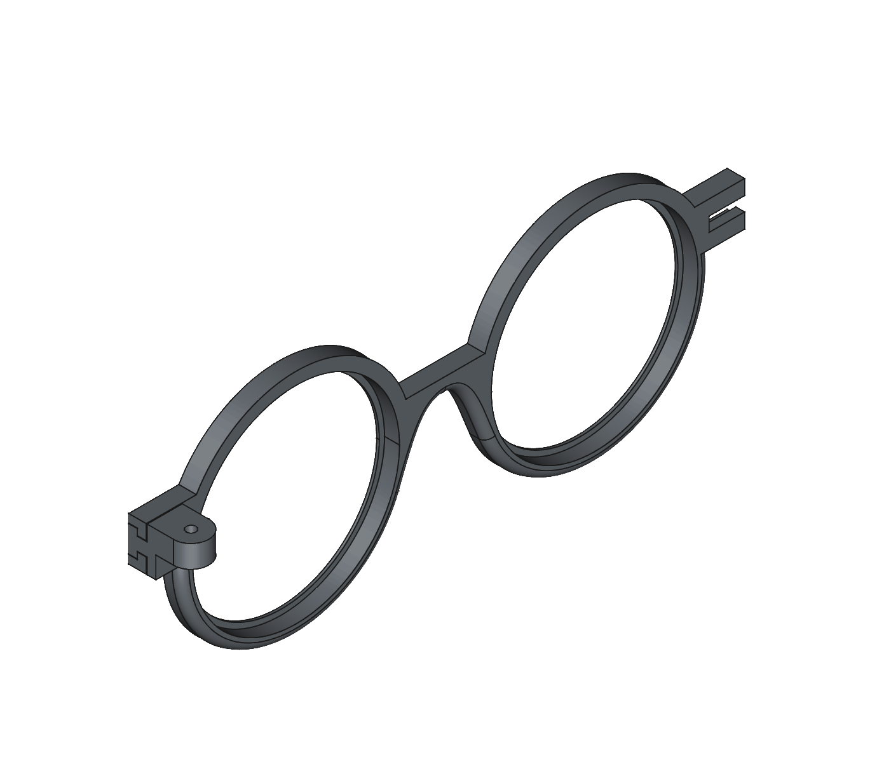
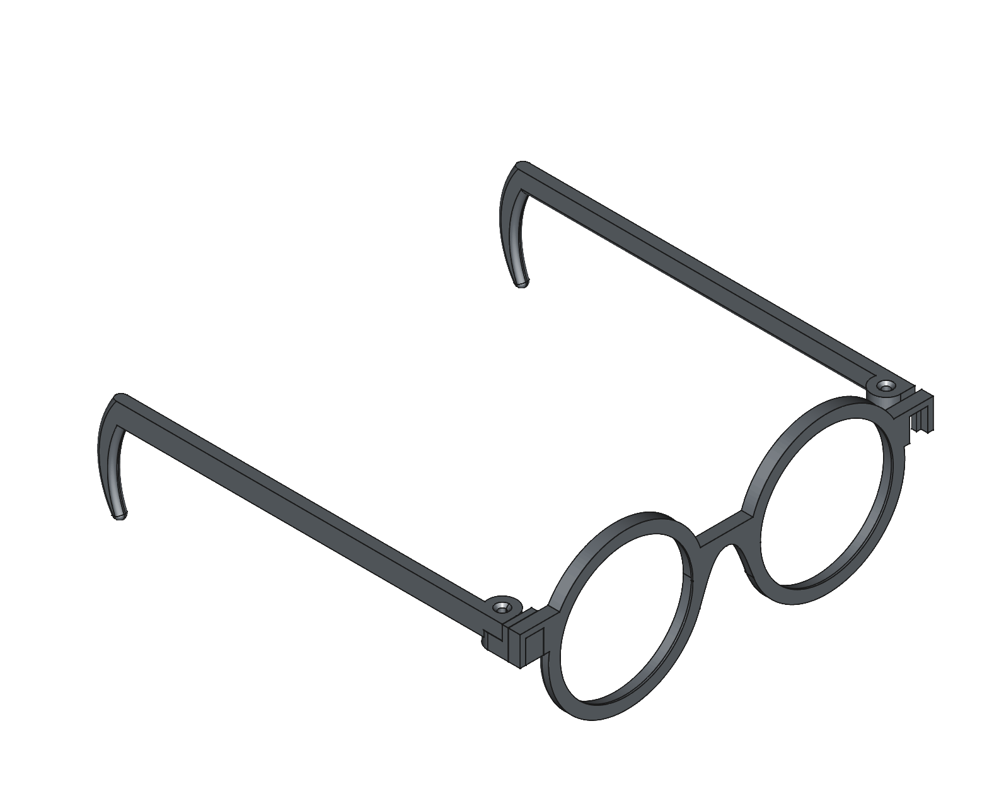
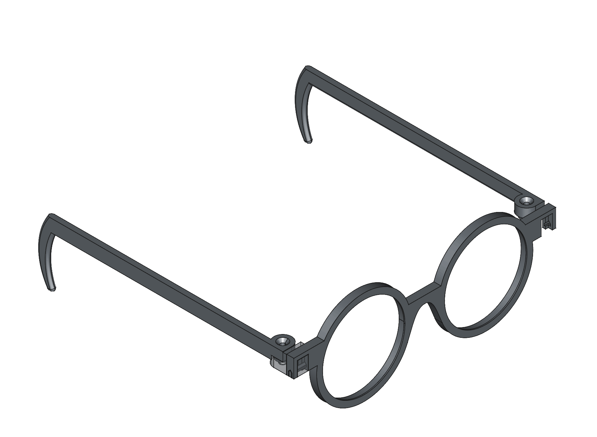

# Version 1 (inaccessible)

- Created version with sideways interlocking mechanism
- Friction-fit mechanism devised
- Not the best. The hinge worked fine, but any pressure from the sides of the glasses would cause the glasses to dismantle

# Version 2 (inaccessible)

- Improved the granularity of tolerances to allow better hinge movement and less issues with the interlock sizing
- Added additional chamfers to assist with hear inserting the screw threads
- Added magnets to small 1mm magnets to interlock mechanism (improved reliability, but the magnet size constraints still caused issues)

# Version 3 (stable)

- More improvements to tolerances
- Fixed issues with model binding issues (FreeCAD issue)
- Swapped to pin interconnect system, optimized for 3d printing

