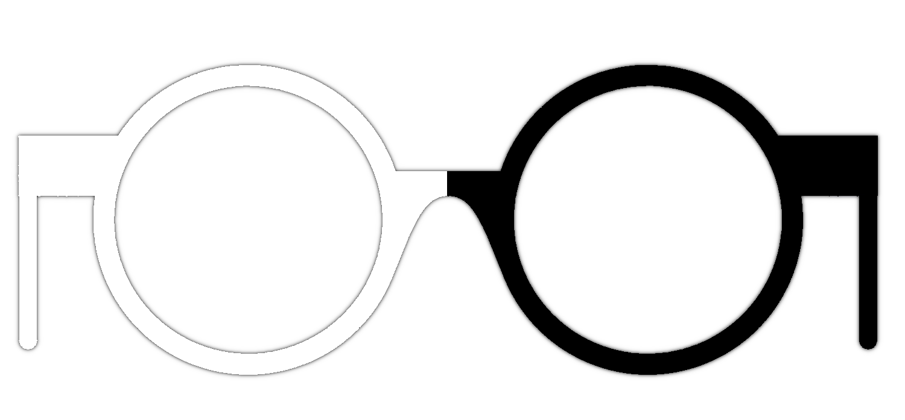
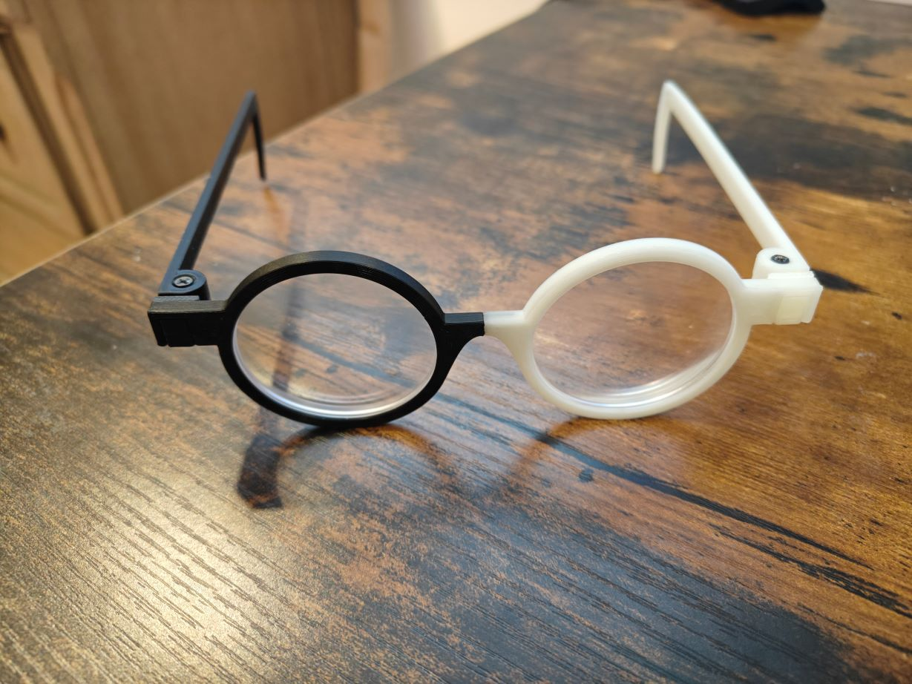

  
   
  <h1>Project Helios</h1>
  
A fully parametric glasses design, optimized for 3D printing

## Why?

**Short:** I wanted glasses that were fully modular, and wouldn't be hard to repair or maintain myself. I also wanted glasses that I could fully customize, and parameterize in case I wanted to change any aspects of the design later.

**Long:**

One of the staples of my personal appearance are round, dual colored glasses. Late last year, my staple pair of glasses started to wear down and deteriorate at the hinge level. After trying to repair them with a heat gun, I realized that this ordeal might be fruitless.

I thought I was smart, and had a few backup pairs of these frames that I ordered a few months after these first arrived. What I didn't anticipate was that, whoever designed and manufactured the original frames had ruined the manufacturing process. The tolerances were different, and heating up the frames to insert the lenses caused the frames to snap where the two colors would meet.

After reflecting on this, I realized I could do this myself. Not only could I make my own frames, I could design it in a way where - as long as I could source round lenses I could manufacture these glasses any way I'd like.

## What sets these apart

- Fully parametric. Every measurement of these glasses can be modified, including tolerances, temple lengths, screw sizing, dimension, and even how strong you want the interconnects to be.
- Design only requires two brass fittings for screws, everything else is friction and mechanically secure
- Fully modular. You can swap out parts of the glasses on a whim.
- Optimized for printing. Using the benefits of fiber-like printing mechanics, these frames are more rugged than any other frame on the marker.
- Accessorize-ability and easy to modify. It's possible to change these glasses to fit whatever modifications you'd like.

## Example

## Licence

These glasses use the [CC BY-NC-SA 4.0](https://creativecommons.org/licenses/by-nc-sa/4.0/deed.en) licence. You can redistribute the files, but any changes made to the glasses that alter their behaviour are meant to be upstream. Please use responsibly.

## Getting started

> I'll be hoping to streamline this process using a new tool I'm making, but most details are available below

**These glasses are meant to be made with PLA.** I usually prefer PETG for mechanical parts, but I noted along each stage of the prototyping phase that PETG does not handle tight tolerances very well (which is a must for glasses). I also noted that most PETGs I have don't tolerate friction-fit as elegantly.

**You will need a pair of calipers to measure your own lenses, and adjust your temple length if needed!**

### No STLs or STEPs?

**No.** Glasses might not seem very complicated, but durable glasses that work best for:

- your printer (and slicer)
- your specific lenses
- the filaments you intent to print with

Are infact, _complicated._

Handing out STL/STEP files without a user actually doing what's needed for their specific pair of glasses is a liability, but the process isn't too hard. Each person will have unique lenses and shapes for their face, that won't be fully reflected with the default sizing.

> A video walking through how to do this will be coming soon!

### Build plate layout

I've included screenshots of what a typical plate assembly should look like:

### Sourcing lenses

This design expects fully round lenses. Given it's a CAD file, you can change the shape yourself, but fully round lenses are usually very affordable and easy to source.

[Here's where I source mine.](https://www.kits.ca/glasses/GL00474/Hagglund.html)

### Configuring

#### Parameters

The [FreeCAD](https://www.freecad.org/) (1.0+) file has many parameters. Here's what most of them do. The most important parameters will be bold, and the rest are configurable depending on what you intend to do with them.

> Any parameters labeled (comp) are computed via equations, and aren't meant to bne configurable. If a parameter isn't listed below, assume it's not used.

- **`tol`- General tolerance amount**
- **`lens_inner_diam` - The diameter of the lens (not with ridge)**
- **`lens_outer_diam` - The diameter of the lense (including ridge)**
- `lens_rim_offset` - How far the ridge of the lens will be from the front
- `lens_thickness`- **Average thickness of the lense**
- `rim_thickness_front` - How wide the rims of the glasses should be
- `rim_thickness_inner` - How thick the rims of the glasses are
- `rim_bottom_fillet` - The fillet of the bottom of the glasses
- `end_piece_offset` - Distance between the top of the rims and the top of the interconnect point of the frame body
- `end_piece_length` - How tall the interconnect point is
- `end_piece_depth` - How far the interconnect point is from the frame

- `bridge_length` - How far the two lenses should be from other
- `bridge_offset` - How far the bridge should be from the top of the rims
- `bridge_depth` - How far down the rims go down the frame
- `hinge_screw_diam` - How wide the screw is
- `temple_length` - How long the glasses temple extends before wrapping around the ear
- **`temple_hook_distance` - How long the hook area extends**
- `temple_hook_thickness` - How thick the hook is
- `temple_hook_radius` - The arc radius of the hook itself (in degrees)

> Anything below this point should not be modified unless you know what you're doing (or like seeing tings break)

- `end_piece_cut_ext` - The internal depth cut for the interconnect
- `end_piece_cut_int` - The internal depth of furthest cut for the glasses
- `end_piece_cut_offset` - How far the cut it from the top of the interconnect point
- `end_piece_layer_tol` - The Z tolerance for the friction lock (hint - make sure it's slightly larger than the normal tolerance)
- `end_piece_frame_cut` - Size of the external cut for the interconnect
- `end_piece_ext_tol`- The X tolerance for the interconnect cut and the internal end piece`
- `pin_size` - The overall pin size (X and Y)
- `pin_offset` - The pin distance from the bottom of the interconnect point
- `pin_outer_cut_depth`- Depth of how far the pin connect cuts into the interconnect point
- `pin_depth` - How deep the pin extends into the frame
- `pin_tol` - The pin tolerance amount (be generous)
- `hinge_offset` How far the hinge is from the end of the interconnect point
- `hinge_depth` - How deep the hinge should go
- `hinge_diam_ext` - How wide the hinge diameter is
- `hinge_diam` - The diameter of the hinge itself
- `hinge_chamfer`- Chamfer needed to reduce friction
- `hinge_insert_diam` - The internal hinge diameter (must be smaller)
- `temple_thickness_height` - How tall the temple of the glasses should be
- `temple_thickness_width - `How wide the temple thickness should be
- `acc_eye_cover_inner_pad` - How much distance between the lense cover and the frame
- `acc_eye_cover_thickness` - How the

#### Print settings

- 0.4 nozzle is best
- 0.2mm layer height works best
- Reduced fan speed if your printer is known to print at a medium speed. Helps encourage better layer adhesion.
- PLA/PLA+ should be preferred.
- Higher temp should be favored if your printer is decent at tolerances. If it's not, a lower temp will work better - but you'll have a worse friction fit.
